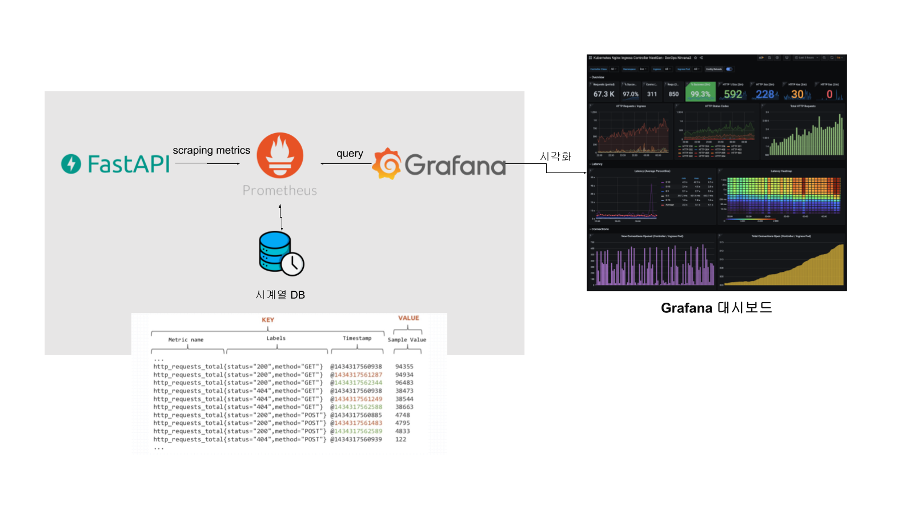

# promethues-grafana-fastapi-tutorial

이 레포지토리는 FastAPI 내에서 prometheus-client sdk를 이용하여 메트릭을 정의하고 Prometheus와 Grafana를 연동하는 방법을 설명합니다.

## 설치 및 실행

### 1. 필요한 패키지 설치
```bash
pip install -r requirements.txt
```

### 2. FastAPI 애플리케이션 실행 (로컬)
```bash
cd app
uvicorn main:app --host 0.0.0.0 --port 8000 --reload
```

### 3. Prometheus와 Grafana 실행 (Docker)
```bash
docker-compose up -d
```

### 4. 서비스 접속 정보:
- FastAPI: http://localhost:8000
- FastAPI Docs: http://localhost:8000/docs
- FastAPI Metrics: http://localhost:8000/metrics
- Prometheus: http://localhost:9090
- Grafana: http://localhost:3000 (기본 계정: admin/admin)

## 기능

- **FastAPI 애플리케이션**: 기본 API 엔드포인트와 메트릭 수집 기능을 제공합니다.
- **Prometheus**: FastAPI 애플리케이션에서 노출된 메트릭을 수집합니다.
- **Grafana**: Prometheus에서 수집된 메트릭을 시각화합니다.

## 메트릭

애플리케이션에서 수집되는 메트릭:

1. `app_requests_total`: HTTP 메소드 및 경로별 요청 수
2. `app_responses_total`: HTTP 메소드, 경로 및 상태 코드별 응답 수
3. `app_requests_processing_time_seconds`: 경로별 요청 처리 시간 히스토그램

## Grafana 대시보드

Grafana에 자동으로 "FastAPI 메트릭 대시보드"가 프로비저닝됩니다. 이 대시보드는 다음과 같은 정보를 제공합니다:

### 요청 및 응답 개요
- 경로별 분당 요청 수
- 상태 코드별 분당 응답 수
- 총 요청 수
- 경로별 요청 비율

### 성능 지표
- 경로별 평균 요청 처리 시간
- 경로별 평균 응답 시간 (최근 5분)

### 트래픽 분석
- 초당 요청 수 (5분 평균)
- 경로별 시간당 요청 증가량

## 튜토리얼

### 부하 테스트

애플리케이션 부하 테스트를 위해 아래와 같이 `random_sleep` 엔드포인트를 호출해봅니다.

```bash
for i in {1..10}; do curl http://localhost:8000/random_sleep; done
```

이제 부하를 늘려본 후, 대시보드에서 확인해봅시다. (약간의 지연이 발생할 수 있습니다.)

```bash
for i in {1..100}; do curl http://localhost:8000/random_sleep; done
```

### 꼭 알아야 할 개념

직접 메트릭을 개발하기 위해서는 꼭 알아야 할 개념이 있습니다. FastAPI, Prometheus, Grafana 각각의 개념을 이해해야 합니다.

1. FastAPI는 Prometheus-client를 이용하여 지표를 정의하고, /metrics 엔드포인트를 통해 Prometheus에 메트릭을 노출합니다.
- 메트릭을 정의하는 방법은 다음과 같습니다.

    ```python
    from prometheus_client import Counter

    # 메트릭 정의
    # 메트릭 변수 = 메트릭 타입("메트릭 이름", "메트릭 설명", ["메트릭 레이블"])
    REQUESTS = Counter("app_requests_total", "Total count of requests by method and path.", ["method", "path"])

    # 메트릭 노출
    @app.get("/metrics")
    async def metrics():
        return Response(content=generate_latest(), media_type=CONTENT_TYPE_LATEST)
    ```
- Prometheus의 metric 타입은 다음과 같습니다. 각 메트릭에 대한 사용법은 https://prometheus.io/docs/concepts/metric_types/ 를 참고하시기 바랍니다.
    - Counter: 오직 증가하거나 재시작 시 0으로 초기화되는 누적 메트릭입니다.
        - 예시: 총 HTTP 요청 수, 오류 수, 처리된 작업 수
    - Gauge: 임의로 증가하거나 감소할 수 있는 단일 숫자 값입니다. 값이 시간에 따라 변동할 수 있습니다.
        - 예시: 현재 메모리 사용량, CPU 사용률, 큐의 대기 작업 수
    - Histogram: 관측된 값들을 사전 정의된 버킷에 분포시켜 빈도 수를 측정하는 메트릭입니다. 각 버킷은 특정 범위의 값을 포함하며, 해당 범위에 속하는 관측값의 수를 누적합니다.
        - 예시: HTTP 요청 지연 시간 분포, 응답 크기 분포
    - Summary: 관측된 값들의 수, 합계, 그리고 지정된 백분위수를 계산하는 메트릭입니다. 클라이언트 측에서 실시간으로 백분위수를 계산합니다.
        - 예시: 특정 요청의 응답 시간 분석, 정확한 지연 시간 백분위수 측정

2. Prometheus는 이 메트릭을 수집하고 저장합니다. 시계열 데이터베이스 역할을 합니다.
- [prometheus.yml](prometheus/prometheus.yml) 파일에는 scrape_configs 설정이 있습니다. 이 설정은 메트릭을 수집할 대상을 정의합니다. job_name: "prometheus"는 자기 자신을, job_name: "fastapi"는 Host에서 실행되고 있는 FastAPI 애플리케이션을 의미합니다. 이를 통해 scraping을 합니다. 자세한 내용은 https://prometheus.io/docs/prometheus/latest/configuration/configuration/ 를 참고하시기 바랍니다.
- 이렇게 수집된 데이터를 http://localhost:9090/ 에서 직접 쿼리해볼 수 있습니다. 예를 들어, 총 요청 수를 조회하고 싶다면 다음과 같이 쿼리합니다.
    ```
    app_requests_total
    ```
- 이렇게 쿼리한 결과는 다음과 같습니다.
    ```
    app_requests_total{instance="host.docker.internal:8000", job="fastapi", method="GET", path="/random_sleep"}         219
    ...
    ```
    이 결과는 총 219번의 GET 요청이 있었음을 의미합니다.
    instance, job, method, path 는 메트릭 레이블입니다. 이 레이블을 통해 메트릭을 필터링할 수 있습니다. 예를 들어, 모든 fastapi job에 대한 요청 수를 조회하고 싶다면 다음과 같이 쿼리합니다.
    ```
    app_requests_total{job="fastapi"}
    ```

3. Grafana는 Prometheus에서 수집한 메트릭을 시각화합니다.
- 그렇기 때문에 prometheus를 연동하기 위해 [datasource.yml](grafana/provisioning/datasources/datasource.yml) 과 같은 DataSource 설정이 필요합니다. 여기에 정의된 데이터소스를 통해 prometheus에 접근할 수 있습니다.
- 또한, 대시보드를 통해 메트릭을 시각화할 수 있습니다. 이 대시보드는 [dashboard.yml](grafana/provisioning/dashboards/dashboard.yml) 파일에 정의되어 있습니다. 여기에 path: /etc/grafana/provisioning/dashboards 라고 정의되어 있으므로 이 경로에 대시보드 파일을 추가하면 자동으로 대시보드가 생성됩니다. docker-compose.yaml 파일에 grafana의 volumes 설정에 - ./grafana/provisioning/datasources:/etc/grafana/provisioning/datasources 와 같이 마운트하고 있기 때문에 이 레포에 있는 대시보드 파일을 자동으로 인식합니다.



### 실습 1: 메모리 사용량 모니터링 메트릭 추가하기

애플리케이션의 메모리 사용량을 모니터링하는 Gauge 메트릭을 직접 [main.py](app/main.py)에 추가해주시기 바랍니다.

1. 필요한 패키지 설치:
```bash
pip install psutil
```

2. 메트릭 정의:
```python
from prometheus_client import Gauge
import psutil

# 메모리 사용량을 모니터링하는 Gauge 메트릭
MEMORY_USAGE = Gauge(
    "app_memory_usage_bytes",
    "Current memory usage of the application in bytes",
    ["type"]  # type 레이블을 사용하여 RSS와 VMS 메모리를 구분
)
```

3. 메트릭 수집:
```python
@app.middleware("http")
async def monitor_requests(request: Request, call_next):
    # 메모리 사용량 업데이트
    process = psutil.Process()
    MEMORY_USAGE.labels(type="rss").set(process.memory_info().rss)  # 실제 물리적 메모리 사용량
    MEMORY_USAGE.labels(type="vms").set(process.memory_info().vms)  # 가상 메모리 사용량
    
    # ... 기존 미들웨어 코드 ...
```

4. Prometheus에서 확인:
```
# RSS 메모리 사용량 조회
app_memory_usage_bytes{type="rss"}

# VMS 메모리 사용량 조회
    app_memory_usage_bytes{type="vms"}
```

이 메트릭은 다음과 같은 특징이 있습니다:
- Gauge 타입: 값이 증가하거나 감소할 수 있는 단일 숫자 값
- 레이블 사용: type 레이블을 통해 RSS와 VMS 메모리를 구분
- 실시간 업데이트: 각 요청마다 메모리 사용량이 업데이트됨

이 메트릭을 Grafana 대시보드에 추가하면 애플리케이션의 메모리 사용량을 실시간으로 모니터링할 수 있습니다.

5. 대시보드에 추가:
json 파일에 직접 개발하는 것은 힘들기 때문에 Grafana UI를 통해 만든 후 export 하여 사용하는 것을 추천드립니다. 먼저 http://localhost:3000/ 에 접속합니다.

RSS 메모리 사용량 조회(app_memory_usage_bytes{type="rss"}) 대시보드 추가 예시
- 상단 메뉴에서 Edit 버튼을 클릭 -> Add -> Visualization 을 클릭합니다.
- 우측 Visualization 타입을 Time series 로 선택합니다.
- 우측 Panel options를 아래와 같이 세팅합니다.
    - Title: 실제 메모리 사용량 (RSS)
    - Values: Mean, Max 선택
    - Standard options에서 Unit을 bytes(IEC)로 선택합니다.
- 좌측 하단의 Queries 에서 아래와 같이 세팅합니다.
    - 쿼리 타입은 기본 Builder로 설정되어 있습니다. Code로 변경하면 쿼리를 직접 작성할 수 있습니다. app_memory_usage_bytes{type="rss"}를 입력합니다.
    - 바로 밑에 Options 탭에서 아래와 같이 세팅합니다.
        - Legend: Custom으로 선택 후 RSS 메모리 입력
- VMS 메모리 사용량 조회(app_memory_usage_bytes{type="vms"}) 대시보드도 위와 같은 방법으로 추가합니다.
    - Title: 가상 메모리 사용량 (VMS)
    - 쿼리는 app_memory_usage_bytes{type="vms"}로 입력합니다.
- 우측 상단의 Save 버튼을 클릭하여 저장합니다.
- 우측 상단의 Settings -> JSON Model에서 지금까지 만든 대시보드를 json 형태로 확인할 수 있습니다. 이 내용을 복사하여 [fastapi_dashboard.json](grafana/provisioning/dashboards/fastapi_dashboard.json) 파일에 붙여넣습니다.
- 이후에는 grafana 볼륨이 삭제되어도 대시보드가 사라지지 않습니다.

answer1 브랜치를 확인하시면 실습 정답을 확인할 수 있습니다.
